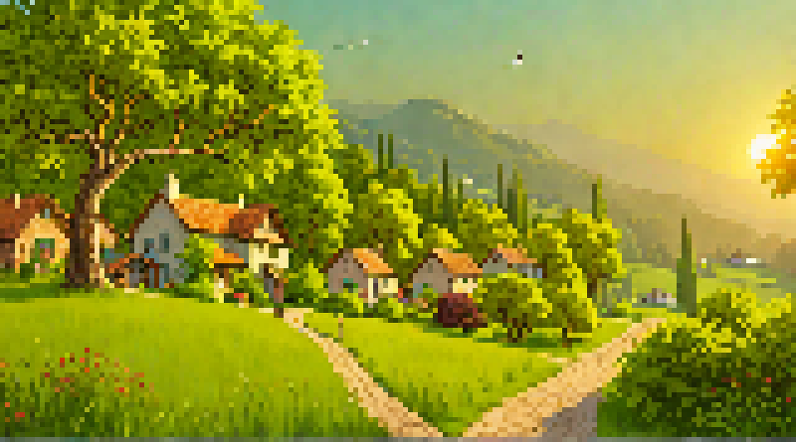

# ⛰️ Infinite Valley

This repository contains a landscape generator that runs forever using SDXL on the backend and designed to be delivered in a chronological view in the browser/webview of your choice.



## Run the Backend

The backend generation is built using SDXL (a free image generation pipeline) and Django. You can be up in running with no configuration beyond installing dependencies.

```bash
git clone https://github.com/nftchance/infinite-valley.git
cd infinite-valley/api
python3 -m venv venv
pip install -r requirements.txt
python manage.py migrate
python manage.py runserver
```

To see the backend processes you will need to create a superuser:

```bash
python manage.py createsuperuser
```
